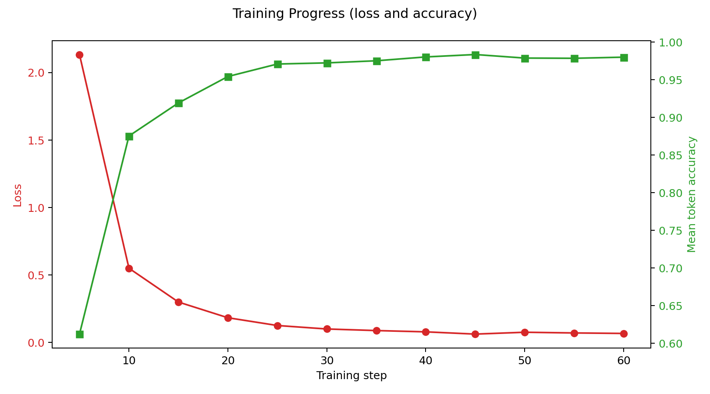
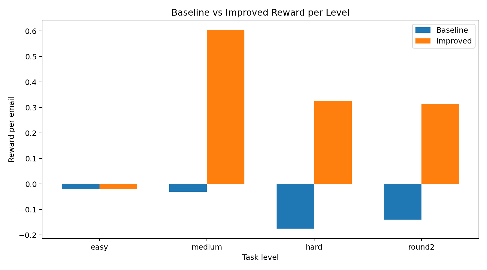

# 📧 Email Triage OpenEnv

> Training LLMs to handle priority-aware, multi-step personal assistant workflows — where decisions cascade, inboxes evolve, and context matters.

[](https://arushi-bassi04-email-openenv.hf.space)
[]()
[]()

🔗 **Live Environment:** https://arushi-bassi04-email-openenv.hf.space/docs
📊 **Benchmark Endpoint:** https://arushi-bassi04-email-openenv.hf.space/benchmark
📓 **Training Notebook:** [Open in Colab](https://colab.research.google.com/drive/1hfHmku08OfkeHoEUBEbJxj3TaxVQoyJp?usp=sharing)
🎥 **Demo Video:** <!-- ADD YOUTUBE LINK HERE -->

---

## Why This Matters

Current LLMs can classify a single email. They struggle when decisions **cascade** — when ignoring one high-priority email triggers a manager follow-up, when a complaint thread requires consistent tone across multiple replies, or when calendar conflicts block downstream actions. Real personal assistant work is sequential, stateful, and consequence-driven.

This environment trains exactly that gap: **multi-step inbox management under partial observability**, with evolving trust, dependency ordering, and long-horizon day progression.

---

## OpenEnv Compliance

| Requirement | Status |
|---|---|
| `reset()` endpoint | ✅ |
| `step()` endpoint | ✅ |
| `state()` endpoint | ✅ |
| Typed Pydantic models | ✅ |
| Deterministic grading | ✅ |
| Docker support | ✅ |
| `openenv.yaml` manifest | ✅ |
| Live HF Space deployment | ✅ |

---

## Training Results

### TRL Run Snapshot

- Loss trend (from training logs): `2.135 -> 0.1662`
- Mean token accuracy trend: `61.23% -> 96.12%`
- Final train loss (trainer report): `0.3192`

### Per-Level Training Results

Canonical SFT training evaluation — Qwen2-0.5B before and after on 826 environment trajectories:

| Level | Before Training | After Training | Delta |
|---|---|---|---|
| Easy | -0.11 | +0.03 | +0.14 |
| Medium | +0.0867 | +0.4367 | +0.35 |
| Hard | -0.3643 | +0.25 | +0.6143 |
| Round2 | -0.203 | +0.3339 | +0.5369 |
| **Average** | **-0.147** | **+0.198** | **+0.344** |

### Training Curves





## Validation: Random vs Learned Policy Baseline

Comparison across difficulty levels shows consistent improvement from learning:

| Level | Random Agent (avg) | Learned Policy | Improvement |
|-------|-------------------|-------------|-------------|
| Easy | -4.476 | +3.450 | **+7.926** |
| Medium | -4.160 | +5.220 | **+9.380** |
| Hard | -5.550 | +5.500 | **+11.050** |
| Round2 | -5.360 | +4.500 | **+9.860** |

Random agent picks `reply`, `ignore`, `escalate` randomly with generic content.
Smart agent uses priority-aware triage, semantic action selection, and context-rich replies.

**Average improvement across all levels: +9.55 reward points per episode.**

---

## What This Environment Tests

Most benchmarks test single-step classification. This environment tests **sequential decision-making under evolving state**:

- An agent receives an inbox of emails with varying priority, domain, and urgency
- Each action (`reply`, `ignore`, `escalate`) changes the world state
- Mishandling a high-priority email spawns a follow-up in the next step
- Dependency ordering — some emails cannot be acted on until prerequisites are resolved
- A 14-day simulated timeline creates overdue penalties
- Sender trust evolves across the episode based on decision quality
- Calendar conflicts must be detected and handled correctly

This is not classification. It is **consequence-aware planning**.

---

## Quick Start

```bash
# Clone and install
git clone https://github.com/rohiitsinghal/email-openenv
cd email-openenv
pip install -r requirements.txt

# Start the server
python main.py

# Run the baseline agent (new terminal)
python inference.py

# Run the random baseline agent
python random_agent.py
```

Or hit the live endpoint directly:
```bash
# Reset environment
curl -X POST "https://arushi-bassi04-email-openenv.hf.space/reset?level=hard"

# Take a step
curl -X POST "https://arushi-bassi04-email-openenv.hf.space/step" \
  -H "Content-Type: application/json" \
  -d '{"action_type": "escalate", "email_id": 1, "content": "Escalating for immediate resolution.", "actor": "coordinator", "feedback": 0.0}'
```

---

## Agent Architecture

The baseline agent uses a three-stage pipeline:

**1. Planning Agent** — sorts the inbox, picks the next email to handle (high priority first, spam last)

**2. Triage Agent** — decides the action using LLM policy (if configured) or heuristic fallback:
- Spam keywords → `ignore`
- High priority + danger signals → `escalate`
- Recent bad feedback + high priority → `escalate`
- Everything else → `reply`

**3. Communication Agent** — generates label-aware reply content:
- Complaints: includes `sorry`, `apologize`, `refund`, `process`
- Work: includes `meeting`, `schedule`, `confirm`
- Spam: no content needed

---

## Reward System

| Event | Reward |
|---|---|
| Optimal action (e.g. escalate complaint on hard) | +1.0 |
| Good but suboptimal (e.g. reply instead of escalate) | +0.5 |
| Wrong action (e.g. ignore a work email) | +0.3 |
| Harmful action (e.g. reply to spam) | −0.5 |
| Ignore high priority | −0.7 |
| Duplicate action on same email | −0.2 |
| Spawning follow-up via mishandling | −0.3 |
| Acting before dependency resolved | −0.3 |
| Overdue email ignored | −0.4 |
| Calendar conflict detected correctly | +0.15 |
| Thread continuity across replies | +0.05 |
| Work/personal action balance | up to +0.06 |
| Step penalty (per step) | −0.02 to −0.08 |
| Completion bonus (full inbox) | +0.2 to +0.5 |

---

## Difficulty Levels

| Level | Emails | What It Tests |
|---|---|---|
| `easy` | 5 | Clear signals, spam vs work, unambiguous labels |
| `medium` | 6 | Mixed urgency, some spam looks like security alerts |
| `hard` | 7 | Deceptive signals, strict label-action matching, reply quality scored |
| `round2` | 8 | Long-horizon, dependencies, day progression, trust evolution, budget tracking |

### Round2 Features
- **14-day simulated timeline** — due-day penalties for overdue emails
- **Dependency ordering** — must resolve prerequisites before downstream emails
- **Sender trust** — evolves per sender role across the episode
- **Budget tracking** — approval budget constrains certain escalations
- **Calendar conflict detection** — committed days create blocking constraints
- **Thread memory** — per-thread action history affects continuity scoring
- **World model state** — work/personal balance tracked across all steps

---

## Environment Specification

```yaml
name: email-triage-openenv
version: "1.0.0"
description: "Email triage environment for training LLMs on priority-aware personal assistant workflows"
hf_space_url: "https://arushi-bassi04-email-openenv.hf.space"
theme: "3.2"
```

**Observation space:** emails list, action history, current day (1–14), user trust (0.0–1.5), world model state

**Action space:** `{action_type, email_id, content, actor, feedback}`

**Reward range:** −2.0 to +1.2

---

## API Reference

**Reset environment:**
```
POST /reset?level=easy|medium|hard|round2
```

**Take a step:**
```
POST /step
```
```json
{
  "action_type": "reply",
  "email_id": 1,
  "content": "Confirmed. I will schedule the meeting shortly.",
  "actor": "coordinator",
  "feedback": 0.0
}
```

**Get current state:**
```
GET /state
```

**Get benchmark scores:**
```
GET /benchmark
```

---

## Project Structure

```
email-openenv/
├── my_env_v4/
│   ├── env.py          # Environment logic, reward shaping, cascading state
│   ├── grader.py       # Per-level grading functions
│   ├── models.py       # Pydantic models
│   └── tasks.py        # Email datasets per level
├── server/
│   └── app.py          # FastAPI server
├── results/
│   └── reward_curve.png  # Training reward curve (added post training)
├── inference.py        # Baseline two-agent pipeline
├── random_agent.py     # Random baseline for comparison
├── main.py             # Server entrypoint
├── openenv.yaml        # OpenEnv manifest
├── pyproject.toml      # Makes Space pip-installable
├── BENCHMARK.md        # Full benchmark results with per-email traces
└── Dockerfile
```

---

## Docker

```bash
docker build -t email-env .
docker run -p 7860:7860 email-env
```

---

## Additional Materials

- 📓 Training Notebook (Colab): [Open in Colab](https://colab.research.google.com/drive/1hfHmku08OfkeHoEUBEbJxj3TaxVQoyJp?usp=sharing)
- 🎥 Demo Video (YouTube): <!-- ADD LINK -->
- 📊 HF Space: https://arushi-bassi04-email-openenv.hf.space
- 💻 GitHub: https://github.com/rohiitsinghal/email-openenv