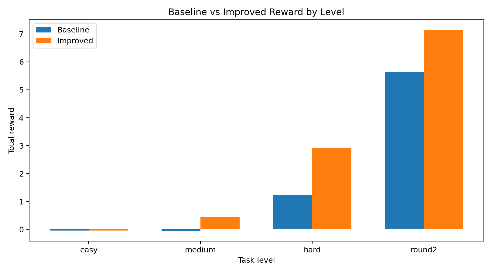
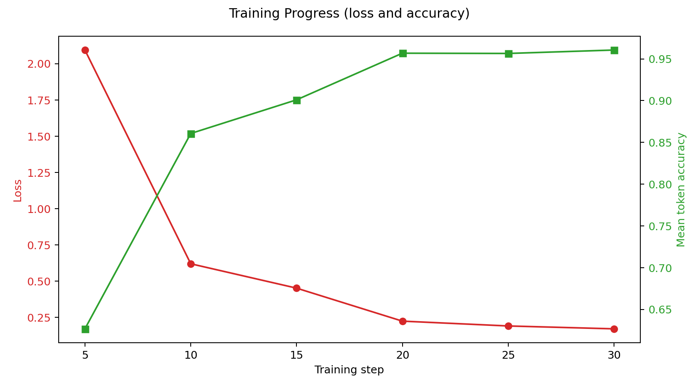

# 🚀 Email Triage OpenEnv
### A Real-World, Multi-Step Decision Environment for Evaluating Intelligent Agents

🔗 Live Demo: https://rsthepro-email-openenv.hf.space/docs

## TL;DR For Judges

- Problem: train an assistant to make correct, ordered, multi-step email decisions under ambiguity.
- Environment: OpenEnv-compatible API with `reset`, `step`, `state` and `round2` long-horizon mode.
- Training: Colab-ready HF TRL script at `training/minimal_trl_colab.py`.
- Evidence: committed JSON metrics + committed PNG plots.
- Story materials: short script at `BLOG_VIDEO_SCRIPT_2MIN.md`.

## Rubric Alignment At A Glance

| Judging Criterion | Weight | What This Repo Shows | Evidence |
|---|---:|---|---|
| Environment Innovation | 40% | Multi-agent signals, long-horizon day progression, dependencies, work+personal balancing | `my_env_v4/env.py`, `my_env_v4/tasks.py`, `openenv.yaml` |
| Storytelling & Presentation | 30% | Problem -> Environment -> Results -> Why it matters, plus short demo script | `README.md`, `BLOG_VIDEO_SCRIPT_2MIN.md` |
| Showing Improvement in Rewards | 20% | Baseline vs improved reward metrics + plots | `training/reward_improvement.json`, `assets/reward_comparison.png`, `assets/training_curve.png` |
| Reward & Training Pipeline | 10% | Working TRL Colab pipeline with saved artifacts | `training/minimal_trl_colab.py`, `outputs/reward_summary.json`, `training/COLAB_QUICKSTART.md` |

---

## 🧠 Overview
This project implements a **realistic, production-inspired email triage environment** built using the OpenEnv specification.

Unlike toy environments, this system evaluates **sequential decision-making under constraints**, simulating how real AI agents operate in workplace scenarios.

Agents are required to:
- 📩 Understand email content
- ⚡ Prioritize based on urgency
- 🧠 Make optimal decisions (reply / ignore / escalate) under ambiguity
- 🔁 Maintain state across multiple steps
- 🚫 Avoid invalid or redundant actions

## 🎯 Problem, Environment, Results, Why It Matters

### Problem
Office assistants handle mixed intent, ambiguous urgency, and conflicts between work and personal commitments. Most benchmarks test one-shot classification, which does not capture this reality.

### Environment
`Email OpenEnv` is a multi-step environment where an agent must choose among `reply`, `ignore`, `escalate` while managing:
- priority constraints,
- dependency ordering,
- long-horizon effects (`round2`),
- work/personal balance,
- user trust evolution.

### Results
From `training/reward_improvement.json` (metric: `reward_per_email`):
- baseline_avg: `-0.1092`
- improved_avg: `0.1466`
- delta_avg: `+0.2558`

From `training/multiseed_benchmark.json`:
- includes per-level `mean +/- std` across 5 seeds
- includes ranked policy comparison table in `training/judge_summary.md`

From Colab TRL training run:
- train_loss reduced to around `0.6256` by the end of 30 steps.

### Why It Matters
This setup evaluates whether an LLM can improve in a realistic assistant workflow, not just classify isolated text snippets.

### 3-Minute Reproduction (Judge Fast Path)

```bash
# local
python main.py

# in Colab (copy-paste cells from quickstart)
!python training/evaluate_rewards.py
!python training/minimal_trl_colab.py
!python training/generate_plots.py
```

Expected outputs:
- `training/reward_improvement.json`
- `training/multiseed_benchmark.json`
- `training/judge_summary.md`
- `outputs/reward_summary.json`
- `assets/reward_comparison.png`
- `assets/training_curve.png`

---

## 🔥 Why This Environment Stands Out

Most benchmarks test *single-step classification*.

This environment tests:
- ✅ Multi-step reasoning
- ✅ Workflow correctness
- ✅ Priority-aware decision making
- ✅ State tracking and memory
- ✅ Robust, deterministic evaluation

- ✅ Multiple task distributions (easy / medium / hard)
- ✅ Ambiguous and deceptive scenarios (e.g., urgent-looking spam, low-priority complaints)
- ✅ Non-binary reward shaping (best / partial / harmful actions)

👉 It closely mirrors **real-world AI assistant behavior**.

---

## ⚙️ Key Features

### 🧩 Multi-Step Environment
- Processes an entire inbox (not just one email)
- Requires sequential decision-making
- Maintains internal state across steps

---

### ⚡ Priority-Aware Logic
Each email includes an `urgency_hint`:
- 🔴 High → Must be handled first
- 🟡 Medium → Context-dependent
- 🟢 Low → Can be deferred

Violations are penalized → encourages realistic workflows

---

### 🎯 Intelligent Reward System

| Behavior | Reward |
|---------|--------|
| Best action (optimal) | +1.0 |
| Good but suboptimal | +0.3 to +0.8 |
| Incorrect decision | -0.1 |
| Harmful decision | -0.5 to -0.7 |
| Step penalty | -0.02 |
| Priority violation | -0.3 |
| Duplicate action | -0.2 |
| Completion bonus | +0.5 |

✔ Uses **non-binary grading** to evaluate decision quality  
✔ Rewards reasoning under ambiguity, not just correctness

---

### 🧠 Stateful Decision Tracking
- Maintains history of actions
- Prevents duplicate processing
- Enables reasoning over past steps

---

### 🧩 Multi-Task Evaluation
- Supports 4 task distributions (`easy`, `medium`, `hard`, `round2`)
- Each task has its own grading behavior
- Ensures agents generalize across scenarios

---

### 🛡 Robust & Deterministic
- Fully deterministic grading
- No randomness in evaluation
- Offline-compatible (no API dependency required)

---

## 🔌 API Endpoints

### 🔄 Reset Environment
```
POST /reset?level=easy|medium|hard|round2
```

### ▶️ Take Step
```
POST /step
```
Example:
```json
{
  "action_type": "reply",
  "email_id": 1,
  "content": "Acknowledged. We are handling this now.",
  "actor": "coordinator",
  "feedback": 0.0
}
```

### 📊 Get State
```
GET /state
```

---

## 🎮 Difficulty Levels

| Level | Description |
|------|------------|
| Easy | Clear signals (spam vs work vs complaint) |
| Medium | Mixed intent + moderate ambiguity |
| Hard | Deceptive and ambiguous cases requiring judgment |
| Round2 | Mixed work + personal long-horizon scenarios with dependencies |

Run Round 2 mode:
```bash
curl -X POST "http://localhost:8000/reset?level=round2"
python inference.py
```

Round 2 alignment implemented in code:
- Multi-agent interaction signal via `actor`
- Long-horizon timeline via `current_day` and due-day handling
- World modeling via `domain`, `user_trust`, and `world_model`
- Self-improvement hook via action `feedback` and adaptive baseline policy

---

## 🤖 Baseline Agent

Run the baseline agent:
```
python baseline/run_baseline.py
```

---

## 🐳 Docker Setup

### Build
```
docker build -t email-env .
```

### Run
```
docker run email-env
```

---

## 📁 Project Structure

```
my_env_v4/
  env.py
  models.py
  tasks.py
  grader.py

inference.py
Dockerfile
openenv.yaml
README.md
```

---

## ✅ OpenEnv Compliance

✔ step(), reset(), state() implemented  
✔ Typed models (Pydantic)  
✔ Deterministic grading  
✔ Dockerized execution  
✔ openenv.yaml defined  

---

## 🏆 Hackathon Submission Pack

This repository includes the core artifacts to maximize judging score:

- Training script (HF TRL, Colab-ready): `training/minimal_trl_colab.py`
- Colab quickstart steps: `training/COLAB_QUICKSTART.md`
- 2-minute blog/video narrative: `BLOG_VIDEO_SCRIPT_2MIN.md`
- Winning checklist and score strategy: `HACKATHON_WINNING_CHECKLIST.md`

## 🔗 Submission Links (fill before final submit)

- Hugging Face Space URL: `<ADD_SPACE_URL>`
- Mini blog or short video URL: `<ADD_BLOG_OR_VIDEO_URL>`

## ✅ Minimum Requirements Checklist

- [x] OpenEnv-based environment
- [x] Working training script using HF TRL (Colab)
- [x] Evidence of training run and metrics artifacts
- [ ] Public Hugging Face Space link added above
- [ ] Mini blog or <2 minute video link added above

### Recommended submission flow

1. Deploy app to Hugging Face Spaces (OpenEnv compliant endpoint).
2. Run baseline metrics on `easy`, `medium`, `hard`, `round2`.
3. Run Colab training script and export reward summary.
4. Publish blog/video using the 2-minute script.
5. Attach links and metrics artifact in final submission.

### Reward Improvement Evidence

Run:

```bash
python training/evaluate_rewards.py
```

This writes:

- `training/reward_improvement.json`

Current sample output in this repo shows a positive average delta between a naive baseline policy and adaptive policy.

## 📈 Plots (committed artifacts)

These are committed to the repository as requested in judging guidance:

- Reward comparison: `assets/reward_comparison.png`
- Training curve: `assets/training_curve.png`

Regenerate plots with:

```bash
python training/generate_plots.py
```





---

## 💡 What Makes This Unique

This is **NOT just classification**.

It evaluates:
- 🧠 Decision order
- ⚡ Priority handling
- 🔁 Multi-step reasoning
- 📊 Workflow correctness
- 🎭 Tests decision quality under ambiguity and conflicting signals

👉 Closer to real production AI systems than academic benchmarks.

---

## 🧪 Use Cases

- AI Email Assistants
- Customer Support Automation
- Reinforcement Learning Environments
- Agent Benchmarking Systems

---

## 🔮 Future Scope

- Email threading
- Multi-agent collaboration
- Time-based penalties
- Real-world dataset integration

---

## 🏁 Conclusion

A **realistic, high-signal evaluation environment** for modern AI agents.

Designed to test not just *what* decisions are made — but *how* and *in what order*.

---

⭐ If you found this useful, consider starring the repo!